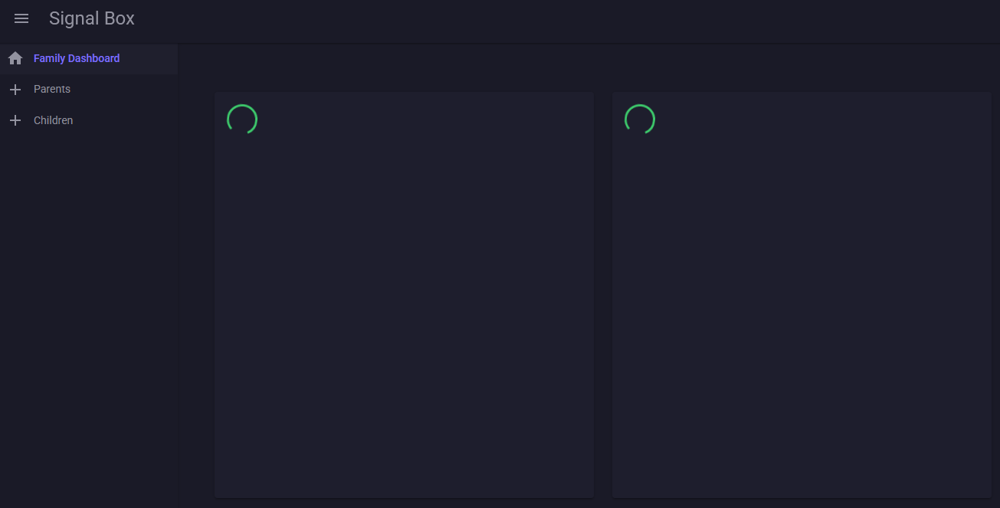
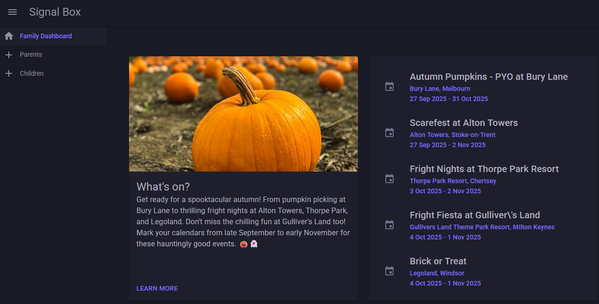

# Signal Box

## :movie_camera: Background

This software is an exploration of .NET Aspire, using the technology to build and run a microservice architecture on local development environments.

From Aspire's [documentation](https://learn.microsoft.com/en-us/dotnet/aspire/get-started/aspire-overview):

> Aspire gives you a unified toolchain: launch and debug your entire app locally with one command, then deploy anywhere—Kubernetes, the cloud, or your own servers—using the same composition.

In addition to exploring Aspire, this solution also implements local language models using LM Studio and a MudBlazor UI.

Based on the strengths of both Aspire and Mudblazor, I decided to build a dashboard where each widget relies on one or more microservices to manage some aspect of family life.

## :white_check_mark: Scope
- [x] Create working Aspire solution.
- [x] Create a set of services.
- [x] Integrate LM running on local via OpenAI like API.
- [x] Create a working MudBlazor UI.
- [x] Implement orchestration services.
- [x] Implement a "What's on?" widget

## :telescope: Future Gazing
- [ ] Explore resilience policies with Polly.
- [ ] Deploy via the Aspire manifest file.
- [ ] Test the LM integrations using smaller models.
- [ ] Consider options for running an always-on dashboard (Raspberry Pi?).
- [ ] Design additional widgets.
- [ ] Implement a "Personal calendar" widget.
- [ ] Implement an "On this day" widget.
- [ ] Implement a "Daily word challenge" widget.
- [ ] Implement a "Bin days" widget.

## :beetle: Known defects
No known defects.

## :crystal_ball: Use of AI
[GitHub Copilot](https://github.com/features/copilot) was used to assist in the development of this software.

## :rocket: Getting Started

### :computer: System Requirements

#### Software

> [!NOTE]
> VS Code Insiders does not appear to work with Aspire at this time, I will retry in the future and update documentation as necessary.

> [!WARNING]
> I am using the new [SLNX format](https://devblogs.microsoft.com/dotnet/introducing-slnx-support-dotnet-cli/) for my solution file. This requires version 9.0.200 of the .NET SDK.
>
> For version 24.04 (LTS) of Ubuntu (which I am currently running on my laptop), the most up-to-date version of .NET 9.0 is accessed from the .NET [backports registry](https://learn.microsoft.com/en-us/dotnet/core/install/linux-ubuntu-decision#register-the-ubuntu-net-backports-package-repository) and is [9.0.111](https://launchpad.net/~dotnet/+archive/ubuntu/backports) (as of writing).

#### Hardware

A system capable of running LM Studio is required.

Details of my personal system are below.

> [!NOTE]
> The hardware in use on my PC includes an Accelerated Processor Unit (APU) which combines CPU and GPU on a single chip. Recommendations for alternative hardware can be found [here](https://lmstudio.ai/docs/app/system-requirements), performance will depend upon the models you choose to run (and other operational factors).

### :floppy_disk: System Configuration

#### LM Studio

Configure LM Studio as per the [documentation](https://lmstudio.ai/docs/app/basics).

Download a model; you can use [community leaderboards](https://huggingface.co/spaces/OpenEvals/find-a-leaderboard) to help select an appropriate model.

Use the Developer tab to run your chosen model as an [API server](https://lmstudio.ai/docs/app/api).

> [!WARNING]
> I have noticed when using the Vulkan llama.cpp (Windows) runtime that some models are failing to load.
>
> I am able to use the CPU llama.cpp (Windows) runtime, however this limits the inference to CPU resources only which significantly affects performance.
>
> This issue has been reported [here](https://github.com/lmstudio-ai/lmstudio-bug-tracker/issues/1081).
> 
> Driver support for larger models is [being provided](https://www.amd.com/en/blogs/2025/amd-ryzen-ai-max-upgraded-run-up-to-128-billion-parameter-llms-lm-studio.html) for my hardware. I wil revist this when drivers are updated, to see if that resolves the issue.

#### Docker

Docker needs to be running, no additional configuration is needed for the software to run the necessary containers.

### :wrench: Development Setup

Clone the repository.

Open in Visual Studio code.

Build the projects.

## :zap: Features

### Whats on widget

- The application gathers data regarding events currently being advertised in the local area.
- It passes the data to a local language model to summarise the events.
- The summary and the event data is then presented on the dashboard.

## :paperclip: Usage

Start the application.

From the Aspire dashboard, load the `frontend-web` project.

The dashboard will begin to load the data:

Once the data is ready, the dashboard will update the view:

## :wave: Contributing

This repository was created primarily for my own exploration of the technologies involved.

## :gift: License

I have selected an appropriate license using [this tool](https://choosealicense.com//).

This software is licensed under the [MIT](LICENSE) license.

## :book: Further reading

More detailed information can be found in the documentation:
* [Resources](docs/resources.md)